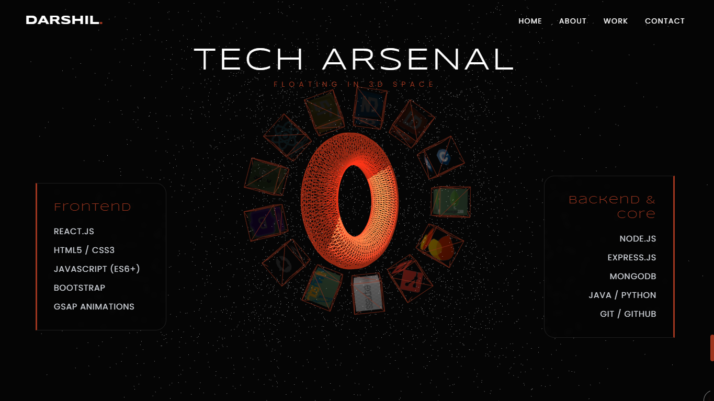
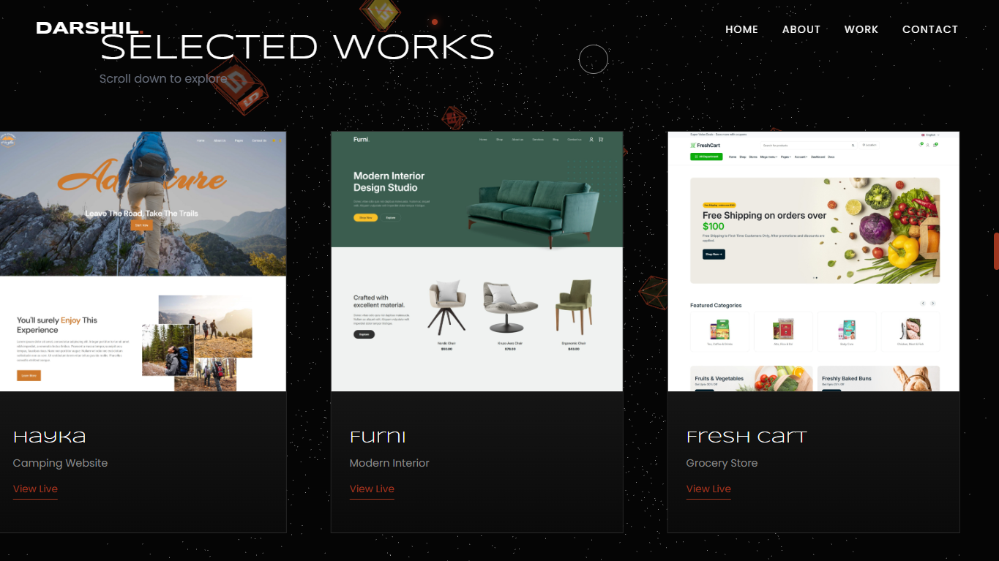

# 🚀 3D Digital Architect Portfolio

> **"I don't just write code; I solve problems in 3D space."**

An immersive, high-performance **3D Portfolio Website** crafted to showcase advanced web development skills. This project blends **Three.js** for 3D environments with **GSAP** for industry-leading animations, delivering a seamless and interactive user experience.

---

## 🌐 Live Demo

---

## 🛠️ Tech Stack (The Arsenal)

Built with a focus on performance, aesthetics, and modern standards.

| Category | Technologies |
|----------|--------------|
| **Core** |    |
| **Styling** |  |
| **3D Graphics** |  |
| **Animations** |   |
| **Icons** |  |

---

## ✨ Key Features

* **🌌 Immersive 3D Environment:** An interactive starry background with floating particles and fog effects using Three.js.
* **🧊 Cyber Ring Skill System:** A dynamic, rotating 3D ring displaying tech skills that expands and reacts to scroll interactions.
* **🖱️ Custom Cursor Interaction:** A specialized cursor with reactive hover states (dots & rings) for a premium feel.
* **📱 Fully Responsive:** Optimized for all devices, featuring a custom Glassmorphism Sidebar menu for mobile users.
* **🎭 Fluid Animations:** Professional text reveals, page transitions, and element stagger effects powered by GSAP.
* **↔️ Horizontal Scroll Project Gallery:** A unique, horizontal scrolling section to showcase projects with depth and perspective.
* **⚡ Optimized Performance:** Implements `THREE.LoadingManager`, WebP image compression, and efficient rendering loops for load times < 3 seconds.

---

## 📸 Visual Tour

| Hero Section | Skills Ring |
|:---:|:---:|
|  |  |

| Horizontal Projects | Mobile Menu |
|:---:|:---:|
|  |  |

---

## 📄 License & Copyright

**© 2026 Darshil Goyani. All Rights Reserved.**

This project is the intellectual property of **Darshil Goyani**. It is intended for **portfolio demonstration purposes only**.

* ⛔ **You may NOT** use this code for your own personal or commercial projects.
* ⛔ **You may NOT** copy, modify, or distribute the source code.
* ✅ **You MAY** view the code for educational learning.

If you wish to use any part of this project, please contact me directly for permission.